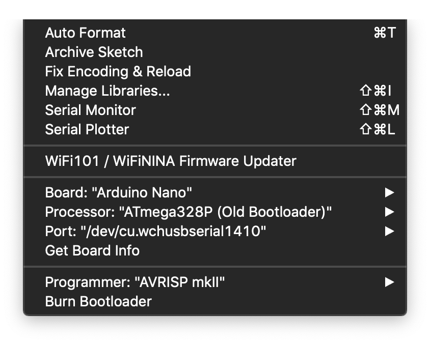

# Arduino Nano
The Arduino Nano chips used for these trials were Nano clones with the following
specifications.

## Getting Started
Before getting started it is important to note that these specific Arduino Nano
chipsets are considered clones, not originals.

The difference lies within the integrated circuit (IC) responsible for serial to
USB communication. A standard Arduino is equipped with an FTDI or FT232 serial
to USB IC, while the Chinese manufactured clones are equipped with a CH340G.

### What does this mean for me?
In order to use the Arduino Desktop IDE on macOS or Windows you will need to
install the appopriate driver in order for the on-board USB to communicate with
the Arduino Nano CH340G chipset.

### Where can I find this driver?
Our experiments and trials have all been executed on a Macbook Pro with macOS.
Windows drivers have not been tested because of this.

#### 2018-12-31
As of this writing it is possible to install the driver onto a macOS operating
system using the following steps:

A [macOS compatible driver can be found on Github](https://github.com/adrianmihalko/ch340g-ch34g-ch34x-mac-os-x-driver)
and installed using Homebrew.

Prepare the package using Homebrew.
```
brew tap mengbo/ch340g-ch34g-ch34x-mac-os-x-driver https://github.com/mengbo/ch340g-ch34g-ch34x-mac-os-x-driver
```

Install the package using Homebrew
```
brew cask install wch-ch34x-usb-serial-driver
```

#### 2019-01-01
The driver install via Homebrew on 2018-12-31 did not work for the specific
Arduino that I am using with macOS High Sierra 10.13.6

#### 2019-01-05

21:30:29 | All Homebrew drivers uninstalled. New CH34x_Install_v1_5 drivers 
           have been installed and are currently being tested.

11:12:01 | CH34x_Install_v1_5 drivers have not been functioning properly. I
           am unable to get a Basic application uploaded to the Arduino Nano.

           Drivers were obtained from supposed Chinese manufacturer via
           http://www.wch.cn/download/CH341SER_MAC_ZIP.html

           I have executed multiple tutorials attempting to work around this.
           They include restarting under recovery mode on macOS and executing
           `sudo nvram boot-args="kext-dev-mode=1" and uninstalling removing
           `sudo rm -f /Library/Extensions/usbserial.kext`.

00:12:00 | I have decided to attempt to install an older version of the driver
           labeld CH34x_Install_v1_3.

           I uninstalled all previous drivers prior to *_v1_3 installation.
           
           After installation the Driver Installer forces you to reboot.
           
           After reboot I was able to successfully move on to Uploading a
           sketch to the Arduino Nano device. 

## Uploading
In order to upload to the device I needed to use the following settings in the
Arduino IDE.

These settings can be found in the macOS Arduino application by clicking
Tools > * from the menu bar.

- Board: Arduino Nano
- Processor: AT328P (Old Bootloader)
- Port: /dev/cu.wchusbserial1420 (in my case)



### Basic > Bare Minimum
2019-01-05 00:27:28 Successfully Verified and Uploaded Basic Bare Minimum

### Basic > Blink
2019-01-05 00:28:13 Successfully Verified and Uploaded Basic Blink

## Overview
WYPH Mini Nano V3.0 Module ATmega328P 5V 16MHz CH340G Chip Microcontroller
Development Board

### Specifications
Specifications:
- Microcontroller: Atmel ATmega328
- Architecture: AVR
- Operating voltage: 5V
- Input voltage: 7-12V
- Flash memory: 32 KB of which 2 KB used by bootloader
- SRAM: 2 KB
- Clock frequency: 16 MHz
- Analog I / O pins: 8
- EEPROM: 1 KB
- DC current per I / O pins: 40 mA (I / O pins)
- Digital I / O pins: 22
- PWM output: 6
- Power consumption: 19 mA
- Dimensions: 0.70 "x 1.70''

### Input and Output
- Each of the 14 digital pins on the Nano can be used as an input or output,
  using pinMode(), digitalWrite(), and digitalRead() functions.
- Some pins have specialized functions: Serial: 0 (RX) and 1 (TX). Used to
  receive (RX) and transmit (TX) TTL serial data. These pins are connected to
  the corresponding pins of the CH340G USB chip.
